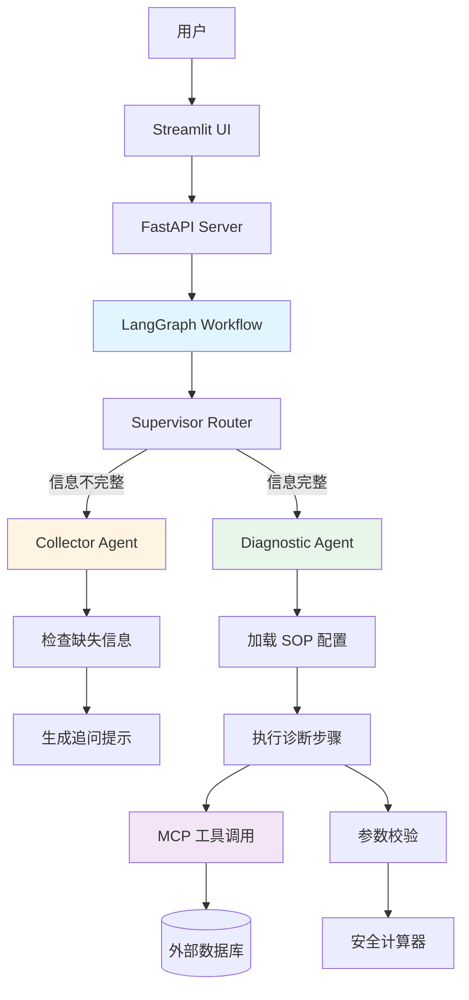

# 🔧 电动车售后智能客服系统

<div align="center">

**基于 LangGraph 的电动车售后智能诊断系统**

[](https://www.python.org/)
[](https://github.com/langchain-ai/langgraph)
[](https://fastapi.tiangolo.com/)
[](https://streamlit.io/)

</div>

---

## 📖 项目简介

普小售后智能客服系统是一个专为电动车售后服务设计的智能诊断系统，采用多智能体架构，能够：

- 🤖 **智能信息收集** - 自动识别缺失信息并引导用户补充
- 🔍 **SOP 诊断流程** - 基于标准化操作流程进行故障排查
- 🛠️ **参数安全校验** - 木桶原理计算最大安全电流，防止硬件损坏
- 🔌 **MCP 工具集成** - 自动查询控制器兼容性等外部数据
- 💬 **对话式交互** - 友好的 Streamlit 界面，支持多轮对话

### 核心功能

| 功能模块 | 说明 | 状态 |
|---------|------|------|
| **信息收集 Agent** | 检查并收集车辆、控制器、电池等关键信息 | ✅ 已完成 |
| **诊断执行 Agent** | 按照 SOP 流程逐步排查故障 | ✅ 已完成 |
| **参数校验 Agent** | 计算安全电流，识别系统短板 | ✅ 已完成 |
| **MCP 工具调用** | 查询控制器兼容性、配件信息等 | ✅ 已完成 |
| **对话状态管理** | 支持多轮对话，保持上下文 | ✅ 已完成 |

---

## 📋 目录

- [项目简介](#-项目简介)
- [系统架构](#-系统架构)
- [执行流程](#-执行流程)
- [快速开始](#-快速开始)
- [项目结构](#-项目结构)
- [开发调试](#-开发调试)
- [部署说明](#-部署说明)
- [开发文档](#-开发文档)

---

## 🏗️ 系统架构

### 技术栈

```
前端层:  Streamlit (对话界面)
         ↓
API层:   FastAPI (RESTful API)
         ↓
编排层:  LangGraph (多智能体工作流)
         ↓
Agent层: Collector → Diagnostician → Validator
         ↓
工具层:  MCP Client (外部数据查询)
         ↓
知识层:  YAML Templates (SOP 流程配置)
         ↓
模型层:  OpenAI GPT-4 (LLM 推理)
```

### 核心组件



---

## 🔄 执行流程

### 1. 完整对话流程

```
用户输入 "我想调大电流"
    ↓
FastAPI 接收请求
    ↓
LangGraph 启动工作流
    ↓
┌─────────────────────────────────────┐
│  Supervisor Router (路由决策)        │
│  - 检查信息完整性                    │
│  - 检查诊断状态                      │
└─────────────────────────────────────┘
    ↓
    ├─→ [信息不完整] → Collector Agent
    │   ├─ 检查缺失字段
    │   ├─ 生成追问提示
    │   └─ 返回: "请提供控制器型号..."
    │
    └─→ [信息完整] → Diagnostic Agent
        ├─ 加载 SOP 配置
        ├─ 执行当前步骤
        │   ├─ step_1: 确认全车电压
        │   ├─ step_2: 核对控制器匹配性 (MCP 工具)
        │   ├─ step_3: 检查转接线
        │   ├─ step_4: 电机自学习确认
        │   └─ step_5: 协议与功能检查
        ├─ 调用 MCP 工具 (如需要)
        ├─ 参数校验 (如需要)
        └─ 返回诊断结果
    ↓
返回给用户
```

### 2. 信息收集流程

```python
# 必需信息清单
required_info = {
    "controller_model": "控制器型号",
    "vehicle_model": "车辆型号",
    "motor_power": "电机功率",
    "battery_type": "电池类型 (铅酸/锂电)",
    "bms_current": "锂电池保护板电流 (锂电必填)"
}

# 收集流程
if 信息不完整:
    → 生成缺失字段列表
    → 礼貌追问用户
    → 等待用户补充
else:
    → 进入诊断流程
```

### 3. SOP 诊断流程

```yaml
# sop_diagnostic.yaml 配置示例
steps:
  - id: step_1_voltage
    title: "确认全车电压"
    action: "text_input"
    prompt: "请确认全车电压是多少。"
    check_logic:
      type: "range_check"
      min_ratio: 0.97
      max_ratio: 1.17
    on_fail:
      message: "电压异常，请检查..."
    on_success:
      next: "step_2_match"
```

### 4. MCP 工具调用流程

```
诊断步骤需要外部数据
    ↓
检测 mcp_tool 配置
    ↓
提取参数 (vehicle_model, controller_model)
    ↓
调用 MCP Client
    ↓
    ├─→ [模拟模式] → 返回内置数据
    └─→ [真实模式] → 查询外部服务
    ↓
解析结果
    ↓
    ├─→ [兼容] → 继续下一步
    └─→ [不兼容] → 推荐替代型号
```

---

## 🚀 快速开始

### 前置要求

- Python 3.11+
- pip 或 conda
- OpenAI API Key（或兼容的 API）

### 1️⃣ 克隆项目

```bash
git clone <repository-url>
cd agent_app
```

### 2️⃣ 创建虚拟环境

```bash
# 使用 conda (推荐)
conda create -n agent_app python=3.11
conda activate agent_app

# 或使用 venv
python -m venv .venv
source .venv/bin/activate  # Linux/Mac
.venv\Scripts\activate     # Windows
```

### 3️⃣ 安装依赖

```bash
# 安装所有依赖
pip install -r requirements.txt
```

<details>
<summary>📦 核心依赖列表</summary>

```
langgraph          # 多智能体工作流编排
langchain-core     # LangChain 核心库
langchain-openai   # OpenAI 集成
fastapi            # Web API 框架
uvicorn            # ASGI 服务器
streamlit          # 前端界面
pyyaml             # YAML 配置解析
python-dotenv      # 环境变量管理
pydantic           # 数据验证
pydantic-settings  # 配置管理
```

</details>

### 4️⃣ 配置环境变量

创建 `.env` 文件（可参考 `.env.example`）：

```bash
# LLM 配置
OPENAI_API_KEY=sk-your-api-key-here
OPENAI_BASE_URL=https://api.apiyi.com/v1
OPENAI_MODEL_NAME=gpt-4-turbo

# 应用配置
APP_ENV=development
LOG_LEVEL=INFO

# Redis (可选，用于会话持久化)
REDIS_URL=redis://localhost:6379/0
```

### 5️⃣ 启动服务

#### 🎯 方式 1: 一键启动（推荐）

```bash
# 启动后端服务（调试模式，自动重载）
chmod +x start_debug.sh
./start_debug.sh
```

在**另一个终端**启动前端：

```bash
streamlit run src/agent_app/frontend/ui.py
```

#### 🔧 方式 2: 手动启动

```bash
# 终端 1: 启动后端
cd src
uvicorn agent_app.runtime.server:app --host 0.0.0.0 --port 8000 --reload

# 终端 2: 启动前端
streamlit run src/agent_app/frontend/ui.py
```

#### 🐛 方式 3: VSCode 调试模式

1. 打开 VSCode
2. 按 `F5` 或点击 "Run and Debug"
3. 选择 `Python: FastAPI Server (Debug)`
4. 在另一个终端运行 Streamlit

### 6️⃣ 访问应用

| 服务 | 地址 | 说明 |
|------|------|------|
| 🎨 **前端界面** | http://localhost:8501 | Streamlit 对话界面 |
| 🔌 **后端 API** | http://localhost:8000 | FastAPI 服务 |
| 📚 **API 文档** | http://localhost:8000/docs | Swagger UI |

### 7️⃣ 快速测试

在前端界面输入：

```
我想调大电流
```

系统会自动：
1. 检查信息完整性
2. 引导你补充必要信息
3. 执行诊断流程
4. 给出安全建议

---

## 📁 项目结构

```
agent_app/
├── 📂 src/agent_app/                    # 源代码目录
│   │
│   ├── 📂 agents/                       # 🤖 Agent 实现层
│   │   ├── base.py                     # Agent 基类（定义标准接口）
│   │   ├── collector.py                # 信息收集 Agent
│   │   │                               #   - 检查必需信息完整性
│   │   │                               #   - 生成追问提示
│   │   ├── executor.py                 # 诊断执行 Agent（核心）
│   │   │                               #   - 加载 SOP 配置
│   │   │                               #   - 执行诊断步骤
│   │   │                               #   - 调用 MCP 工具
│   │   ├── planner.py                  # 规划 Agent（预留）
│   │   │                               #   - 模板选择逻辑
│   │   └── validator.py                # 参数校验 Agent
│   │                                   #   - 木桶原理计算
│   │                                   #   - 安全电流校验
│   │
│   ├── 📂 graph/                        # 🔄 LangGraph 工作流编排
│   │   ├── build.py                    # 图构建（定义节点和边）
│   │   ├── routing.py                  # 路由逻辑（Supervisor）
│   │   │                               #   - 信息完整性检查
│   │   │                               #   - 诊断状态判断
│   │   ├── state.py                    # 状态定义（AgentState）
│   │   │                               #   - 消息历史
│   │   │                               #   - 客户信息
│   │   │                               #   - 诊断状态
│   │   └── constants.py                # 常量定义（节点名称等）
│   │
│   ├── 📂 knowledge/                    # 📚 知识库
│   │   ├── 📂 templates/               # YAML 配置模板
│   │   │   └── sop_diagnostic.yaml    # 诊断 SOP 流程配置
│   │   │                               #   - 步骤定义
│   │   │                               #   - 检查逻辑
│   │   │                               #   - 工具调用
│   │   ├── loader.py                   # 模板加载器（预留）
│   │   └── registry.py                 # 模板注册器（预留）
│   │
│   ├── 📂 runtime/                      # 🚀 运行时环境
│   │   ├── server.py                   # FastAPI 服务器
│   │   │                               #   - /chat 对话接口
│   │   │                               #   - /health 健康检查
│   │   └── cli.py                      # CLI 入口（预留）
│   │
│   ├── 📂 frontend/                     # 🎨 前端界面
│   │   └── ui.py                       # Streamlit UI
│   │                                   #   - 对话界面
│   │                                   #   - 信息表单
│   │                                   #   - 状态显示
│   │
│   ├── 📂 tools/                        # 🔧 工具集成
│   │   └── mcp_client.py               # MCP 工具客户端
│   │                                   #   - 控制器兼容性查询
│   │                                   #   - 模拟数据支持
│   │
│   └── settings.py                     # ⚙️ 配置管理
│                                       #   - 环境变量加载
│                                       #   - LLM 配置
│
├── 📂 changeLog/                        # 📝 开发文档
│   ├── README.md                       # 文档索引
│   ├── CLEANUP_SUMMARY.md              # 代码清理记录
│   ├── FLOW_ANALYSIS.md                # 流程分析
│   ├── MCP_TOOL_INTEGRATION.md         # MCP 集成文档
│   └── ...                             # 其他开发文档
│
├── 📂 .vscode/                          # VSCode 配置
│   └── launch.json                     # 调试配置
│
├── 📄 start_debug.sh                    # 调试启动脚本
├── 📄 test_graph_flow.py                # 图流程测试
├── 📄 test_diagnostic_flow.py           # 诊断流程测试
├── 📄 test_mcp_tool.py                  # MCP 工具测试
├── 📄 requirements.txt                  # Python 依赖
├── 📄 pyproject.toml                    # 项目配置
├── 📄 .env                              # 环境变量（需创建）
└── 📄 README.md                         # 本文档
```

### 核心文件说明

| 文件 | 作用 | 重要性 |
|------|------|--------|
| `graph/build.py` | 定义整个工作流的节点和边 | ⭐⭐⭐⭐⭐ |
| `graph/routing.py` | Supervisor 路由决策逻辑 | ⭐⭐⭐⭐⭐ |
| `agents/executor.py` | 核心诊断逻辑实现 | ⭐⭐⭐⭐⭐ |
| `knowledge/templates/sop_diagnostic.yaml` | SOP 流程配置 | ⭐⭐⭐⭐ |
| `runtime/server.py` | FastAPI 服务入口 | ⭐⭐⭐⭐ |
| `frontend/ui.py` | Streamlit 界面 | ⭐⭐⭐ |
| `tools/mcp_client.py` | MCP 工具集成 | ⭐⭐⭐ |

---

## 🔧 开发调试

### 调试方法总览

| 方法 | 适用场景 | 难度 | 推荐度 |
|------|---------|------|--------|
| VSCode 调试器 | 断点调试、变量查看 | ⭐⭐ | ⭐⭐⭐⭐⭐ |
| 命令行调试模式 | 查看日志、快速迭代 | ⭐ | ⭐⭐⭐⭐ |
| 单元测试 | 测试单个组件 | ⭐⭐ | ⭐⭐⭐⭐ |
| API 测试 | 测试接口功能 | ⭐ | ⭐⭐⭐ |

---

### 🎯 方法 1: VSCode 调试器（推荐）

#### 快速开始

1. **打开 VSCode**
2. **按 `F5`** 或点击 "Run and Debug"
3. **选择配置**：

| 配置名称 | 说明 | 使用场景 |
|---------|------|---------|
| `Python: FastAPI Server (Debug)` | 后端调试 + 热重载 | 开发迭代 |
| `Python: FastAPI Server (No Reload)` | 后端调试（无热重载） | 断点调试 |
| `Python: Test Graph Flow` | 测试图流程 | 单元测试 |

#### 调试快捷键

```
F5              继续执行
F10             单步跳过（不进入函数）
F11             单步进入（进入函数内部）
Shift+F11       单步跳出（跳出当前函数）
Ctrl+Shift+F5   重启调试
```

#### 设置断点

- 在代码行号左侧**点击**设置断点（红点）
- 程序会在断点处**暂停**
- 可以查看**变量值**、**调用栈**、**表达式**

#### 调试面板功能

```
变量 (Variables)     查看当前作用域的所有变量
监视 (Watch)         添加自定义表达式监视
调用堆栈 (Call Stack) 查看函数调用链
断点 (Breakpoints)   管理所有断点
```

---

### 🖥️ 方法 2: 命令行调试模式

```bash
# 启动调试模式（详细日志）
./start_debug.sh
```

#### 调试模式特性

- ✅ **自动重载** - 代码变更自动生效
- ✅ **DEBUG 日志** - 详细的执行日志
- ✅ **请求追踪** - 完整的请求/响应日志
- ✅ **异常堆栈** - 详细的错误信息

#### 日志输出示例

```log
2024-01-11 18:30:15 - INFO - 收到聊天请求 - Thread ID: abc-123
2024-01-11 18:30:15 - DEBUG - 用户消息: 我想调大电流
2024-01-11 18:30:15 - DEBUG - 客户信息: {"vehicle_model": "九号 E100"}
2024-01-11 18:30:15 - INFO - 开始执行 Agent Graph...
2024-01-11 18:30:16 - DEBUG - 路由决策: collector (信息不完整)
2024-01-11 18:30:16 - INFO - Agent Graph 执行完成
```

---

### 🧪 方法 3: 单元测试

#### 测试图流程

```bash
# 测试完整工作流
PYTHONPATH=src python test_graph_flow.py
```

#### 测试诊断流程

```bash
# 测试诊断逻辑
PYTHONPATH=src python test_diagnostic_flow.py
```

#### 测试 MCP 工具

```bash
# 测试 MCP 工具调用
PYTHONPATH=src python test_mcp_tool.py
```

#### 测试单个 Agent

```bash
# 测试信息收集 Agent
PYTHONPATH=src python -c "
from agent_app.agents.collector import collector_node
from agent_app.graph.state import AgentState

state = AgentState(
    messages=[('user', '我想调大电流')],
    customer_info={},
    is_info_complete=False
)
result = collector_node(state)
print(result)
"
```

---

### 🌐 方法 4: API 测试

#### 使用 curl

```bash
# 测试聊天接口
curl -X POST http://localhost:8000/chat \
  -H "Content-Type: application/json" \
  -d '{
    "message": "我想调大电流",
    "thread_id": "test-123",
    "mock_info": {
      "vehicle_model": "九号 E100",
      "controller_model": "Lingbo-72182",
      "battery_type": "lithium",
      "voltage": 72.0,
      "bms_current": 50.0,
      "motor_power": 1200.0
    }
  }'
```

#### 使用 Swagger UI

访问 http://localhost:8000/docs 进行交互式测试

---

### 💡 调试技巧

#### 1️⃣ 查看 LangGraph 执行流程

在 `server.py` 中已添加详细日志：

```python
# 查看节点执行
logger.info(f"执行节点: {node_name}")

# 查看状态变化
logger.debug(f"状态更新: {state}")

# 查看路由决策
logger.info(f"路由到: {next_node}")
```

#### 2️⃣ 调试特定场景

修改 `test_graph_flow.py` 测试不同场景：

```python
# 场景 1: 信息不完整
test_state = {
    "messages": [("user", "我想调大电流")],
    "customer_info": {}  # 缺少信息
}

# 场景 2: 信息完整
test_state = {
    "messages": [("user", "我想调大电流")],
    "customer_info": {
        "vehicle_model": "九号 E100",
        "controller_model": "Lingbo-72182",
        "battery_type": "lithium",
        "voltage": 72.0,
        "bms_current": 50.0,
        "motor_power": 1200.0
    }
}

# 场景 3: 诊断中途
test_state = {
    "messages": [("user", "继续")],
    "customer_info": {...},
    "is_info_complete": True,
    "current_step": 2  # 从第 3 步开始
}
```

#### 3️⃣ 使用 Python 调试器 (pdb)

```python
# 在代码中插入断点
import pdb; pdb.set_trace()

# 或使用 breakpoint() (Python 3.7+)
breakpoint()
```

**pdb 常用命令**：

```
n (next)       执行下一行
s (step)       进入函数
c (continue)   继续执行
p variable     打印变量
pp variable    美化打印
l (list)       显示当前代码
w (where)      显示调用栈
q (quit)       退出调试
```

#### 4️⃣ 查看 Streamlit 日志

```bash
# 启动 Streamlit 时查看详细日志
streamlit run src/agent_app/frontend/ui.py --logger.level=debug
```

---

## 🐛 常见问题

<details>
<summary><b>1. 页面空白或卡住</b></summary>

**问题**: Streamlit 页面显示空白或在某个步骤卡住

**解决方案**:

```bash
# 1. 清除 Streamlit 缓存
rm -rf ~/.streamlit/cache

# 2. 重启后端服务
# 按 Ctrl+C 停止，然后重新启动

# 3. 强制刷新浏览器
# Mac: Cmd + Shift + R
# Windows/Linux: Ctrl + Shift + R
```

</details>

<details>
<summary><b>2. 模块导入错误</b></summary>

**问题**: `ModuleNotFoundError: No module named 'agent_app'`

**原因**: PYTHONPATH 未正确设置

**解决方案**:

```bash
# 方法 1: 设置环境变量
export PYTHONPATH="${PWD}/src:${PYTHONPATH}"

# 方法 2: 在命令前加上
PYTHONPATH=src python test_graph_flow.py

# 方法 3: 使用启动脚本（已自动设置）
./start_debug.sh
```

</details>

<details>
<summary><b>3. API 连接失败</b></summary>

**问题**: 前端无法连接到后端

**解决方案**:

```bash
# 1. 检查后端是否运行
curl http://localhost:8000/health

# 2. 检查端口是否被占用
lsof -i :8000

# 3. 杀死占用端口的进程
lsof -ti:8000 | xargs kill -9

# 4. 重新启动后端
./start_debug.sh
```

</details>

<details>
<summary><b>4. LLM API 错误</b></summary>

**问题**: OpenAI API 调用失败

**可能原因**:
- API Key 无效或过期
- Base URL 配置错误
- 网络连接问题
- 余额不足

**解决方案**:

```bash
# 1. 检查 .env 配置
cat .env | grep OPENAI

# 2. 测试 API 连接
curl -X POST https://api.apiyi.com/v1/chat/completions \
  -H "Authorization: Bearer YOUR_API_KEY" \
  -H "Content-Type: application/json" \
  -d '{"model":"gpt-4-turbo","messages":[{"role":"user","content":"test"}]}'

# 3. 检查环境变量是否加载
PYTHONPATH=src python -c "from agent_app.settings import settings; print(settings.openai_api_key)"
```

</details>

<details>
<summary><b>5. MCP 工具调用失败</b></summary>

**问题**: MCP 工具返回错误或超时

**解决方案**:

```bash
# 1. 测试 MCP 工具
PYTHONPATH=src python test_mcp_tool.py

# 2. 检查模拟模式
# 在 mcp_client.py 中确认 mock_mode=True

# 3. 查看详细日志
# 在 server.py 中设置 LOG_LEVEL=DEBUG
```

</details>

<details>
<summary><b>6. 依赖安装失败</b></summary>

**问题**: pip install 报错

**解决方案**:

```bash
# 1. 升级 pip
pip install --upgrade pip

# 2. 使用国内镜像
pip install -r requirements.txt -i https://pypi.tuna.tsinghua.edu.cn/simple

# 3. 单独安装失败的包
pip install <package-name> --no-cache-dir
```

</details>

---

## 📝 开发指南

### 🤖 添加新的 Agent

#### 1. 创建 Agent 文件

在 `src/agent_app/agents/` 创建新文件，例如 `my_agent.py`：

```python
from typing import Dict, Any
from agent_app.agents.base import BaseAgent
from agent_app.graph.state import AgentState

class MyAgent(BaseAgent):
    """我的自定义 Agent"""

    def invoke(self, state: AgentState) -> Dict[str, Any]:
        """
        执行 Agent 逻辑

        Args:
            state: 当前状态

        Returns:
            状态更新字典
        """
        # 1. 获取当前状态
        messages = state.get("messages", [])
        customer_info = state.get("customer_info", {})

        # 2. 执行业务逻辑
        result = self._do_something(customer_info)

        # 3. 调用 LLM（如需要）
        response = self.llm.invoke([
            ("system", "你是一个助手"),
            ("user", "请处理...")
        ])

        # 4. 返回状态更新
        return {
            "messages": messages + [("assistant", response.content)],
            "my_custom_field": result
        }

    def _do_something(self, info: Dict) -> Any:
        """自定义业务逻辑"""
        pass

# 创建节点函数
def my_agent_node(state: AgentState) -> Dict[str, Any]:
    """节点入口函数"""
    agent = MyAgent()
    return agent.invoke(state)
```

#### 2. 注册到工作流

在 `src/agent_app/graph/build.py` 中注册：

```python
from agent_app.agents.my_agent import my_agent_node

def build_graph():
    workflow = StateGraph(AgentState)

    # 添加节点
    workflow.add_node("my_agent", my_agent_node)

    # 添加边
    workflow.add_edge("supervisor", "my_agent")
    workflow.add_edge("my_agent", END)

    return workflow.compile()
```

#### 3. 更新路由逻辑

在 `src/agent_app/graph/routing.py` 中添加路由：

```python
def supervisor_router(state: AgentState) -> str:
    """路由决策"""
    if state.get("need_my_agent"):
        return "my_agent"
    # ... 其他逻辑
```

---

### 📋 修改诊断流程

编辑 `src/agent_app/knowledge/templates/sop_diagnostic.yaml`：

```yaml
steps:
  - id: my_new_step
    title: "我的新步骤"
    action: "text_input"  # 或 mcp_tool, validation
    prompt: "请输入..."

    # 可选：检查逻辑
    check_logic:
      type: "range_check"
      min_value: 0
      max_value: 100

    # 可选：MCP 工具调用
    mcp_tool:
      tool_name: "my_tool"
      params:
        - "vehicle_model"
        - "controller_model"

    # 可选：失败处理
    on_fail:
      message: "检查失败，请..."
      next: "step_retry"

    # 可选：成功处理
    on_success:
      message: "检查通过"
      next: "step_next"
```

---

### 🔀 添加新的路由逻辑

在 `src/agent_app/graph/routing.py` 中：

```python
def my_custom_router(state: AgentState) -> str:
    """自定义路由逻辑"""

    # 1. 获取状态
    current_step = state.get("current_step", 0)
    is_complete = state.get("is_complete", False)

    # 2. 决策逻辑
    if is_complete:
        return END
    elif current_step < 5:
        return "diagnostician"
    else:
        return "validator"
```

---

### 🔧 添加新的 MCP 工具

在 `src/agent_app/tools/mcp_client.py` 中：

```python
def my_new_tool(param1: str, param2: str) -> Dict[str, Any]:
    """
    新的 MCP 工具

    Args:
        param1: 参数1
        param2: 参数2

    Returns:
        工具执行结果
    """
    # 模拟模式
    if mock_mode:
        return {
            "success": True,
            "data": {...}
        }

    # 真实调用
    try:
        response = requests.post(
            "https://api.example.com/tool",
            json={"param1": param1, "param2": param2}
        )
        return response.json()
    except Exception as e:
        return {
            "success": False,
            "error": str(e)
        }
```

---

### 🎨 自定义前端界面

在 `src/agent_app/frontend/ui.py` 中：

```python
import streamlit as st

# 添加新的侧边栏选项
with st.sidebar:
    st.header("我的自定义选项")
    my_option = st.selectbox("选择", ["选项1", "选项2"])

# 添加新的显示组件
if st.session_state.get("show_my_component"):
    st.info("我的自定义组件")
    st.json({"data": "..."})
```

---

## 🚀 部署说明

### 生产环境部署

#### 方式 1: 使用 Gunicorn（推荐）

```bash
# 1. 安装 gunicorn
pip install gunicorn

# 2. 启动服务（4 个 worker）
gunicorn agent_app.runtime.server:app \
  -w 4 \
  -k uvicorn.workers.UvicornWorker \
  --bind 0.0.0.0:8000 \
  --access-logfile - \
  --error-logfile -
```

#### 方式 2: 使用 Uvicorn

```bash
# 多 worker 模式
uvicorn agent_app.runtime.server:app \
  --host 0.0.0.0 \
  --port 8000 \
  --workers 4 \
  --log-level info
```

#### 方式 3: 使用 Systemd

创建 `/etc/systemd/system/agent_app.service`：

```ini
[Unit]
Description=Agent App Service
After=network.target

[Service]
Type=notify
User=www-data
Group=www-data
WorkingDirectory=/opt/agent_app
Environment="PYTHONPATH=/opt/agent_app/src"
ExecStart=/opt/agent_app/.venv/bin/gunicorn agent_app.runtime.server:app \
  -w 4 \
  -k uvicorn.workers.UvicornWorker \
  --bind 0.0.0.0:8000
Restart=always

[Install]
WantedBy=multi-user.target
```

启动服务：

```bash
sudo systemctl daemon-reload
sudo systemctl enable agent_app
sudo systemctl start agent_app
sudo systemctl status agent_app
```

---

### Docker 部署

#### 1. 创建 Dockerfile

```dockerfile
FROM python:3.11-slim

# 设置工作目录
WORKDIR /app

# 安装依赖
COPY requirements.txt .
RUN pip install --no-cache-dir -r requirements.txt

# 复制源代码
COPY src/ ./src/
COPY .env .env

# 设置环境变量
ENV PYTHONPATH=/app/src
ENV APP_ENV=production

# 暴露端口
EXPOSE 8000

# 健康检查
HEALTHCHECK --interval=30s --timeout=10s --start-period=5s --retries=3 \
  CMD curl -f http://localhost:8000/health || exit 1

# 启动命令
CMD ["uvicorn", "agent_app.runtime.server:app", "--host", "0.0.0.0", "--port", "8000", "--workers", "4"]
```

#### 2. 创建 docker-compose.yml

```yaml
version: '3.8'

services:
  backend:
    build: .
    ports:
      - "8000:8000"
    environment:
      - OPENAI_API_KEY=${OPENAI_API_KEY}
      - OPENAI_BASE_URL=${OPENAI_BASE_URL}
      - OPENAI_MODEL_NAME=${OPENAI_MODEL_NAME}
      - APP_ENV=production
      - LOG_LEVEL=INFO
    volumes:
      - ./logs:/app/logs
    restart: unless-stopped
    healthcheck:
      test: ["CMD", "curl", "-f", "http://localhost:8000/health"]
      interval: 30s
      timeout: 10s
      retries: 3

  frontend:
    build:
      context: .
      dockerfile: Dockerfile.streamlit
    ports:
      - "8501:8501"
    environment:
      - BACKEND_URL=http://backend:8000
    depends_on:
      - backend
    restart: unless-stopped

  # 可选：Redis
  redis:
    image: redis:7-alpine
    ports:
      - "6379:6379"
    volumes:
      - redis_data:/data
    restart: unless-stopped

volumes:
  redis_data:
```

#### 3. 构建和运行

```bash
# 构建镜像
docker-compose build

# 启动服务
docker-compose up -d

# 查看日志
docker-compose logs -f

# 停止服务
docker-compose down
```

---

### Nginx 反向代理

创建 `/etc/nginx/sites-available/agent_app`：

```nginx
upstream backend {
    server 127.0.0.1:8000;
}

upstream frontend {
    server 127.0.0.1:8501;
}

server {
    listen 80;
    server_name your-domain.com;

    # 后端 API
    location /api/ {
        proxy_pass http://backend/;
        proxy_set_header Host $host;
        proxy_set_header X-Real-IP $remote_addr;
        proxy_set_header X-Forwarded-For $proxy_add_x_forwarded_for;
        proxy_set_header X-Forwarded-Proto $scheme;
    }

    # 前端界面
    location / {
        proxy_pass http://frontend/;
        proxy_set_header Host $host;
        proxy_set_header X-Real-IP $remote_addr;
        proxy_set_header X-Forwarded-For $proxy_add_x_forwarded_for;
        proxy_set_header X-Forwarded-Proto $scheme;

        # WebSocket 支持（Streamlit 需要）
        proxy_http_version 1.1;
        proxy_set_header Upgrade $http_upgrade;
        proxy_set_header Connection "upgrade";
    }
}
```

启用配置：

```bash
sudo ln -s /etc/nginx/sites-available/agent_app /etc/nginx/sites-enabled/
sudo nginx -t
sudo systemctl reload nginx
```

---

### 环境变量配置

生产环境 `.env` 示例：

```bash
# LLM 配置
OPENAI_API_KEY=sk-prod-xxxxx
OPENAI_BASE_URL=https://api.openai.com/v1
OPENAI_MODEL_NAME=gpt-4-turbo

# 应用配置
APP_ENV=production
LOG_LEVEL=INFO

# Redis
REDIS_URL=redis://redis:6379/0

# 安全配置
ALLOWED_HOSTS=your-domain.com,www.your-domain.com
CORS_ORIGINS=https://your-domain.com

# 监控
SENTRY_DSN=https://xxxxx@sentry.io/xxxxx
```

---

### 性能优化建议

#### 1. Worker 数量

```bash
# 推荐公式: (2 × CPU 核心数) + 1
# 例如 4 核 CPU: (2 × 4) + 1 = 9 workers
gunicorn -w 9 ...
```

#### 2. 连接池配置

```python
# settings.py
class Settings(BaseSettings):
    # LLM 连接池
    llm_max_retries: int = 3
    llm_timeout: int = 30

    # Redis 连接池
    redis_max_connections: int = 50
```

#### 3. 缓存策略

```python
# 使用 Redis 缓存 LLM 响应
from functools import lru_cache

@lru_cache(maxsize=1000)
def get_llm_response(prompt: str) -> str:
    return llm.invoke(prompt)
```

#### 4. 日志配置

```python
# 生产环境使用 JSON 格式日志
import logging
import json

class JSONFormatter(logging.Formatter):
    def format(self, record):
        return json.dumps({
            "timestamp": self.formatTime(record),
            "level": record.levelname,
            "message": record.getMessage(),
            "module": record.module
        })
```

---

## 📚 开发文档

所有开发过程中的文档、修复记录、集成说明都集中在 `changeLog/` 目录中。

### 文档分类

| 分类 | 文档 | 说明 |
|------|------|------|
| 🏗️ **架构设计** | [FLOW_ANALYSIS.md](./changeLog/FLOW_ANALYSIS.md) | 系统架构和工作流程分析 |
| 🔌 **工具集成** | [MCP_TOOL_INTEGRATION.md](./changeLog/MCP_TOOL_INTEGRATION.md) | MCP 工具集成文档 |
| 🔧 **问题修复** | [FIX_SUMMARY.md](./changeLog/FIX_SUMMARY.md) | 问题修复记录 |
| 🐛 **调试记录** | [DEBUGGING_SUMMARY.md](./changeLog/DEBUGGING_SUMMARY.md) | 调试过程和方法 |
| 🧹 **代码清理** | [CLEANUP_SUMMARY.md](./changeLog/CLEANUP_SUMMARY.md) | 代码重构记录 |
| 📋 **完整索引** | [changeLog/README.md](./changeLog/README.md) | 所有文档的导航 |

### 推荐阅读顺序

```
新手入门:
  1. 📖 本 README.md - 了解项目概况
  2. 🎯 FLOW_ANALYSIS.md - 理解系统架构
  3. 🚀 快速开始 - 运行项目

深入开发:
  4. 🔌 MCP_TOOL_INTEGRATION.md - 了解工具集成
  5. 📝 开发指南 - 学习如何扩展
  6. 🔧 FIX_SUMMARY.md - 了解已知问题

问题排查:
  7. 🐛 DEBUGGING_SUMMARY.md - 调试技巧
  8. 🐛 常见问题 - 快速解决方案
```

---

## 🤝 贡献指南

### 提交代码

1. Fork 本仓库
2. 创建特性分支 (`git checkout -b feature/AmazingFeature`)
3. 提交更改 (`git commit -m 'Add some AmazingFeature'`)
4. 推送到分支 (`git push origin feature/AmazingFeature`)
5. 开启 Pull Request

### 代码规范

- 使用 Python 3.11+ 特性
- 遵循 PEP 8 代码风格
- 添加类型注解
- 编写文档字符串
- 添加单元测试

### 提交信息规范

```
<type>(<scope>): <subject>

<body>

<footer>
```

**Type 类型**:
- `feat`: 新功能
- `fix`: 修复 bug
- `docs`: 文档更新
- `style`: 代码格式调整
- `refactor`: 代码重构
- `test`: 测试相关
- `chore`: 构建/工具链更新

**示例**:
```
feat(agent): 添加新的诊断 Agent

- 实现基于规则的诊断逻辑
- 添加单元测试
- 更新文档

Closes #123
```

---

## 📞 联系方式

- **问题反馈**: [GitHub Issues](https://github.com/your-repo/issues)
- **功能建议**: [GitHub Discussions](https://github.com/your-repo/discussions)
- **邮件**: your-email@example.com

---

## 📄 License

MIT License

Copyright (c) 2024 普小售后智能客服系统

Permission is hereby granted, free of charge, to any person obtaining a copy
of this software and associated documentation files (the "Software"), to deal
in the Software without restriction, including without limitation the rights
to use, copy, modify, merge, publish, distribute, sublicense, and/or sell
copies of the Software, and to permit persons to whom the Software is
furnished to do so, subject to the following conditions:

The above copyright notice and this permission notice shall be included in all
copies or substantial portions of the Software.

THE SOFTWARE IS PROVIDED "AS IS", WITHOUT WARRANTY OF ANY KIND, EXPRESS OR
IMPLIED, INCLUDING BUT NOT LIMITED TO THE WARRANTIES OF MERCHANTABILITY,
FITNESS FOR A PARTICULAR PURPOSE AND NONINFRINGEMENT. IN NO EVENT SHALL THE
AUTHORS OR COPYRIGHT HOLDERS BE LIABLE FOR ANY CLAIM, DAMAGES OR OTHER
LIABILITY, WHETHER IN AN ACTION OF CONTRACT, TORT OR OTHERWISE, ARISING FROM,
OUT OF OR IN CONNECTION WITH THE SOFTWARE OR THE USE OR OTHER DEALINGS IN THE
SOFTWARE.

---

## 🌟 致谢

感谢以下开源项目：

- [LangGraph](https://github.com/langchain-ai/langgraph) - 多智能体工作流编排
- [LangChain](https://github.com/langchain-ai/langchain) - LLM 应用框架
- [FastAPI](https://fastapi.tiangolo.com/) - 现代 Web 框架
- [Streamlit](https://streamlit.io/) - 快速构建数据应用
- [OpenAI](https://openai.com/) - 强大的 LLM 能力

---

<div align="center">

**⭐ 如果这个项目对你有帮助，请给一个 Star！⭐**

Made with ❤️ by 普小团队

</div>
